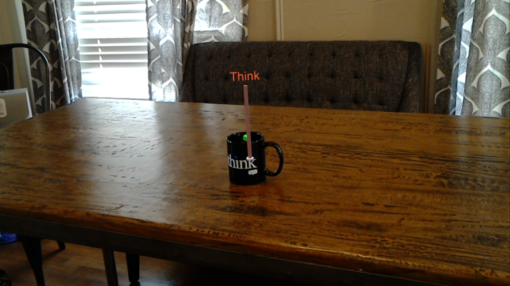

# HoloLens Reprojection
This sample project demonstrates how you can use the HoloLens LocatableCamera to project 2D image analysis results back into world space to add a visualization to the objects detected.

The user snaps a photo with the front-facing web camera on HoloLens and then posts it to an inference pipeline for object detection and classification.

## References

* [LocatableCamera](https://docs.microsoft.com/en-us/windows/mixed-reality/locatable-camera)
* [LocatableCamera in Unity](https://docs.microsoft.com/en-us/windows/mixed-reality/locatable-camera-in-unity)
* [Custom Vision Tutorial](https://docs.microsoft.com/en-us/windows/mixed-reality/mr-azure-302b#chapter-6---create-the-customvisionanalyser-class)
* [How to build a custom classifier with Custom Vision](https://docs.microsoft.com/en-us/azure/cognitive-services/custom-vision-service/getting-started-build-a-classifier)

## Prerequisites

* [Unity 2018.3.3 or greater](https://unity3d.com)
* [Visual Studio 2017](https://visualstudio.microsoft.com/)
* [Windows 10](https://www.microsoft.com/en-us/software-download/windows10)
* A HoloLens

## Setup

I got started by training a custom vision classifier on http://customvision.ai. (see above for how to get started)

For my sample, I create a model to detect coffee mugs and classify them.

You will need to create a train your own model on the Custom Vision portal, or roll your own inference pipeline and integrate the reporjection components into your project.

Once you publish the iteration that you're happy with, you will input that URL and the Prediction Key value into the CustomVisionServiceConfig object.

Then, it will need to be set on the SceneController component.

That should be all you need to do. Don't forget to setup your HoloLens project settings and then build out to Visual Studio.

## Screenshot

If you find any issues with the sample, please submit an issue. Thank you!
